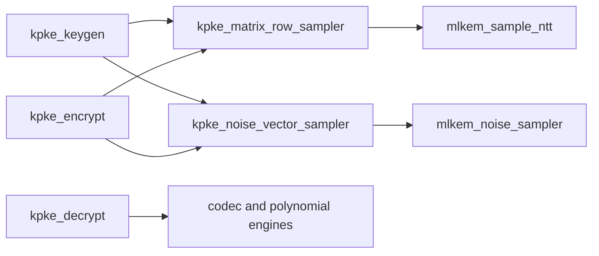

# K-PKE controllers

## kpke

### Purpose
FIPS 203 Algorithms 13--15 K-PKE support

### Active modules

- `kpke_decrypt`
- `kpke_encrypt`
- `kpke_keygen`
- `kpke_matrix_row_sampler`
- `kpke_noise_vector_sampler`

### Retained support / legacy modules

### Reading notes

- Use the module catalog for parents, children, domain, handshake, state ownership, TB, and runner links.
- Treat named domain signals as authoritative; NORMAL and NTT are distinct representations.
- Fixed cycle counts are stated only where the implementation contract proves them; controllers otherwise use done/busy completion.

### Dependency graph

### Main control flow

Each controller accepts a complete 32-bit little-endian byte record, dispatches
the named sampler/codec/polynomial children, and streams its final record only
after the child result has been committed.  `kpke_keygen`, `kpke_encrypt`, and
`kpke_decrypt` use variable controller latency; `done` is the completion
contract.  Read state names in the order `INPUT`, child `*_START`, `*_WAIT`,
workspace read/drain, `OUTPUT`, and `SCRUB`.

### Representations and ownership

- External K-PKE records are byte streams in low-byte-first lane order.
- Polynomial workspace ports carry explicit `NORMAL` or `NTT` tags; do not
  infer an NTT representation from a Montgomery multiply alone.
- The controllers own their record buffers and temporary poly/polyvec arrays;
  child workspaces retain their documented local ownership until completion.
- Reset and explicit zeroize invalidate control state and clear selected local
  state; this guide does not claim exhaustive physical clearing of child RAMs.

### Common reading mistakes

- `in_valid` is accepted only when the corresponding `in_ready` state is
  active; a byte word is not implicitly buffered by the controller boundary.
- A child `done` says its result is ready for the parent phase transition; it
  does not mean every parent output word has already been streamed.
- Legacy codec adapters remain for independently tested compatibility paths;
  they are not evidence that they are on the release hierarchy.

### Recommended file order and verification

Read `kpke_matrix_row_sampler.v`, `kpke_noise_vector_sampler.v`, then
`kpke_keygen.v`, `kpke_encrypt.v`, and `kpke_decrypt.v`.  Use the module
catalog for the precise child/TB mapping; the main focused runner is
`sim/scripts/run_kpke_roundtrip.sh` and the block runners are named after the
controller.
