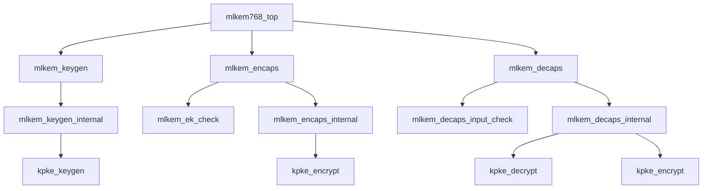

# ML-KEM top-level controllers

## mlkem

### Purpose
FIPS 203 Algorithms 16--21 ML-KEM support

### Active modules

- `mlkem768_top`
- `mlkem_decaps`
- `mlkem_decaps_input_check`
- `mlkem_decaps_internal`
- `mlkem_ek_check`
- `mlkem_encaps`
- `mlkem_encaps_internal`
- `mlkem_keygen`
- `mlkem_keygen_internal`

### Retained support / legacy modules

- `mlkem_byte_buffer`
- `mlkem_ct_compare_select`
- `mlkem_dk_assemble`
- `mlkem_dk_parse`
- `mlkem_zeroize_controller`

### Reading notes

- Use the module catalog for parents, children, domain, handshake, state ownership, TB, and runner links.
- Treat named domain signals as authoritative; NORMAL and NTT are distinct representations.
- Fixed cycle counts are stated only where the implementation contract proves them; controllers otherwise use done/busy completion.

### Dependency graph

### Main control flow

`mlkem768_top` arbitrates public KeyGen, Encaps, and Decaps commands and
routes their input, output, RNG, status, and zeroize handshakes.  The public
wrappers perform the stated input checks before launching their internal
controller.  The internal controllers implement FIPS 203 record construction:
KeyGen builds `ek` and `dk`; Encaps computes `H(ek)`, `G(m || h)`, and the
K-PKE ciphertext; Decaps parses `dk`, recomputes the ciphertext, compares all
1088 bytes, and selects `K_prime` or `J(z || c)`.

### Memory ownership and reset

- Wrapper record buffers own public byte streams until their child has
  accepted the record; internal controllers own the decoded/derived local
  payloads until output streaming and scrub completion.
- The public stream is valid/ready.  `out_last` marks the final 32-bit word of
  a record; all public record formats are low-byte-first inside a word.
- RNG is an explicit external transaction: public KeyGen requests 64 bytes and
  public Encaps requests 32 bytes.  Decaps does not request randomness.
- Academic zeroize provides control-state invalidation and selected local
  clearing.  It is not a claim of exhaustive physical lower-datapath erase.

### Common reading mistakes

- `mlkem_ct_compare_select` is an independently tested compatibility helper;
  `mlkem_decaps_internal` contains the active full-record comparison/select.
- A stored `H(ek)` is checked by `mlkem_decaps_input_check` before public
  Decaps starts the internal operation; it is not an output error channel for
  implicit rejection.
- `done` is a pulse after final output acceptance or cleanup, not a replacement
  for the output stream handshake.

### Recommended file order and verification

Read `mlkem768_top.v`, public wrappers, input checkers, and then the three
internal controllers.  Follow their K-PKE and H/G/J child links through the
module catalog.  Use `sim/scripts/run_m8_smoke.sh` for unit smoke coverage and
`sim/scripts/run_m8_regression.sh` for the reduced differential chain.
