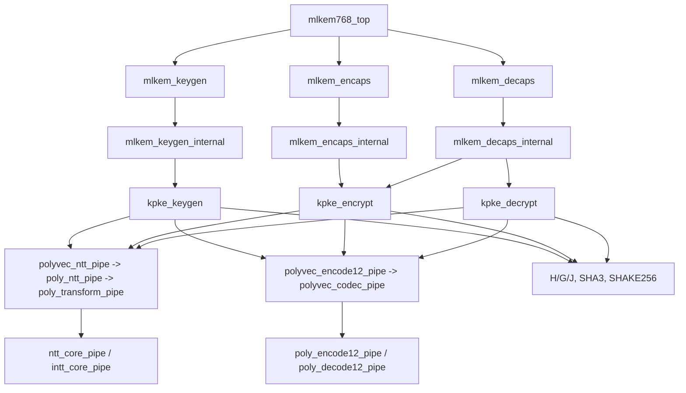

# Active Release Hierarchy

Source of truth: `synth/m9/rtl.f`, `sim/scripts/run_m9_elaboration.sh`, and
selected elaboration rooted at `mlkem768_top`.  The current list has 85 Verilog
sources plus `rtl/common/kyber_params.vh`, defining 87 modules.

## Release-path facts

- `poly_ntt_pipe` is an active forward-NTT adapter selected by
  `polyvec_ntt_pipe` in all K-PKE controllers.
- `poly_encode12_pipe` and `poly_decode12_pipe` are active 12-bit codec
  adapters selected by the K-PKE public-key polyvec codec wrappers.
- The generic `polyvec_elementwise_pipe` contains non-release generate modes;
  only its selected `OP=3` path is part of `mlkem768_top`.
- Four test/compatibility modules are not top-level children but are retained
  because `run_m8_smoke.sh` invokes their unit tests.
- `barrett_reduce` and `conditional_sub_q` remain only as declarations sharing
  the active `rtl/arithmetic/reduction.v` source; neither is selected by the
  elaborated release hierarchy.

For the complete current classification, see [module_catalog.md](module_catalog.md).
Superseded RTL implementations remain available in Git history before
`pre-legacy-prune-b683bd7`.
